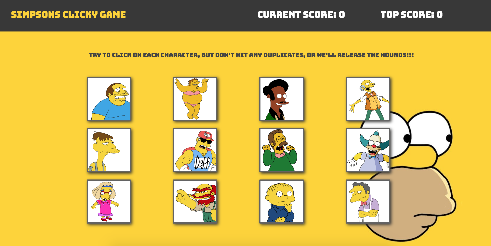

# Simpson's Clicky Game

## Downloading:

<ul>
    <li><b>Step #1</b></li>
    <code>npm install</code>
    <li><b>Step #2</b></li>
    <code>npm start</code>
</ul>

## Gameplay

<ul>
    <li>This is a memory game.</li>
    <li>There are 12 tiles. The player must click on each tile, while they re-shuffle each time. To win, the player must remember which tiles they already clicked on, without clicking the same tile twice. If the same tile is clicked, the score will reset to <strong>0</strong>. If the user matches all 12 tiles, then "Congratulations" will appear next to the game title above the window.</li>
</ul>

This project was bootstrapped with [Create React App](https://github.com/facebook/create-react-app).
